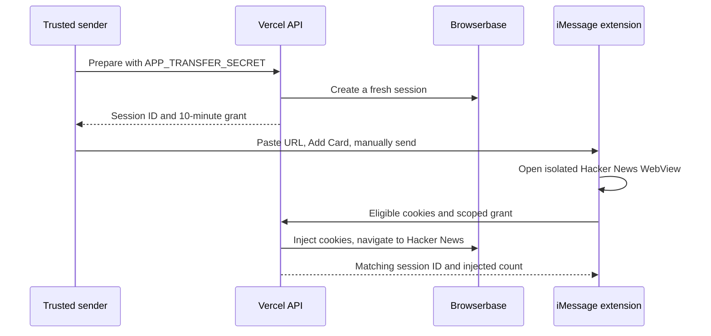

# Architecture

The native targets share the browser and validation code. The Messages
controller owns presentation and composition; transfer coordinators own network
requests, retries, cancellation, and completion state.

## Native responsibilities

- `MessagesViewController`: active conversation, selected card, compact/expanded
  presentation, and card insertion.
- `MessageWebViewController`: isolated webpage, loading/retry UI, navigation
  allowlist, and cookie-store observation. Shared by all native targets.
- `WebViewMessageLink` / `AppClipInvocation`: URL and signed-card claim validation.
- `HackerNewsCookieCapture`: eligible domain/expiry filtering and auth fingerprint.
- `MessagesCookieTransfer`: optional preparation, scoped upload, bounded retries,
  deduplication, and cancellation when inactive or switching cards.
- `AppClipCookieTransfer`: signed-grant uploads and a local completion receipt.

Webpage cards use a nonpersistent cookie store. The older Messages demo UI uses
its own persistent store. Neither can inspect Safari's store. Only eligible
Hacker News cookies are uploaded after detecting the `user` authentication cookie.

Both transfer coordinators reject upload redirects and require matching server
responses. A cancellation invalidates local callbacks; it cannot undo a request
already processed by a remote service.

## Backend responsibilities

`/api/transfers/prepare` creates a new recorded Browserbase session for each
card. It never borrows another user's running session. `/api/cookies` validates
the grant or administrator credential, filters the payload, injects via CDP,
and returns metadata without cookie values.

Transfer grant consumption, SMS handoff replay tracking, and recipient rate
limits use process memory. They are best-effort across serverless instances and
are not atomic across concurrent requests. Public multi-user service requires
shared durable state plus an authenticated preparation flow.

The legacy SMS endpoints and original cookie inspector are retained as separate
experiments. They are not part of the current native sign-in route.
